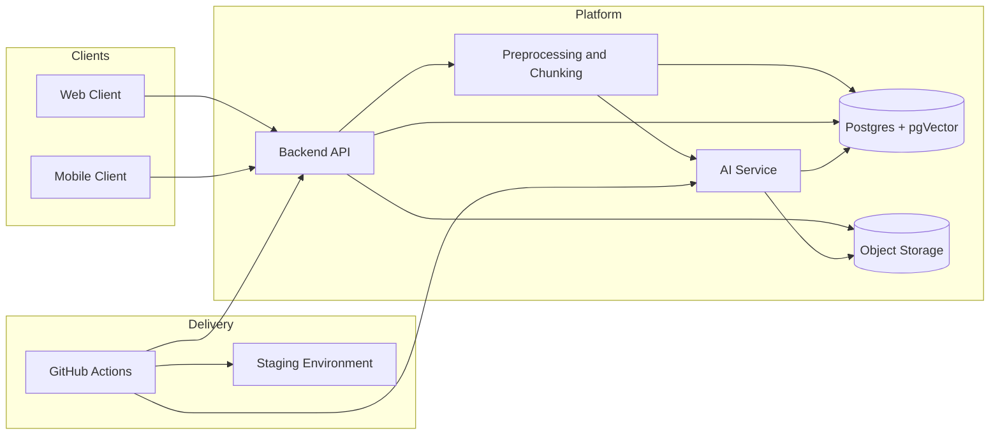

# ExamHacker

ExamHacker is an educational platform for exam preparation that turns study materials into quizzes, cards, and spaced practice flows. The product combines a web client, a mobile client, a backend API, and an AI generation pipeline so students can move from raw material to active repetition with minimal friction.

## Problem

Students often postpone exam preparation until the last moment. Traditional flashcard and quiz tools still require deliberate effort: open the app, pick a deck, and start studying. ExamHacker is designed to reduce that friction by making preparation more passive, more contextual, and easier to repeat.

## Solution

Users upload or provide study materials, the platform prepares the content, the AI layer generates structured quiz payloads, and the result is delivered back to the user as editable packs. The system also supports sharing, tagging, manual editing, and mobile-first repetition flows.

## MVP Focus

- AI-generated quiz packs from study material
- Manual quiz and card editing
- Quiz solving on web and mobile
- Sharing packs by link
- Tags, search, ratings, and comments on public packs
- Mobile learning prompts on unlock or app open
- Source-aware answers and hints
- CI/CD that keeps the platform reproducible and easy to ship

## System Overview

## Architecture

### Backend API

- Handles authentication and user-facing CRUD
- Stores quizzes, cards, tags, comments, ratings, and shared links
- Orchestrates ingestion, generation, search, and delivery

### Preprocessing and Chunking

- Converts study content into clean text
- Splits content into chunks that fit model context windows
- Preserves source metadata for later grounding and traceability

### AI Service

- Accepts cleaned text, chunks, and metadata
- Generates strict JSON quiz payloads
- Produces answers, hints, and source-aware references
- Supports retry and validation so bad generations do not leak into the product

### Data Layer

- **Postgres** stores application state and structured quiz data
- **pgVector** supports retrieval and semantic lookup
- **Object Storage** keeps uploaded documents and derived artifacts

## AI Pipeline

The AI layer is designed as a controlled pipeline, not a raw prompt call.

1. Normalize input into clean text.
2. Chunk the material and attach source metadata.
3. Retrieve relevant context when needed.
4. Generate structured quiz JSON.
5. Validate the payload against the expected schema.
6. Retry generation if the result is malformed or low quality.
7. Persist the final pack with references and metadata.

This approach keeps generation predictable, reduces hallucinations, and makes the output easier to integrate into backend and client workflows.

## CI/CD

The delivery pipeline is part of the product architecture.

- Build and test the main services
- Build Docker images for repeatable deployment
- Cache dependencies to keep pipelines fast
- Run validation checks before deployment
- Deploy to staging from GitHub Actions

The goal is to make shipping boring in the best possible way: consistent builds, clear feedback, and low manual overhead.

## Technical Domains & Module Ownership

- **Mobile Client & UI**: Dasha, Stepan
- **Backend API & Auth**: Alexander, Konstantin
- **Product / Docs / Validation**: Pavel, Timur
- **AI Core, Retrieval Pipeline & CI/CD**: Mikhail

This split reflects the real technical boundaries of the project. The AI and delivery layer is the part that keeps the system reliable, reproducible, and ready to evolve without turning the rest of the stack into a moving target.

## 6-Week Plan

### Week 1

- [ ] Create UI prototype in Figma
- [x] Set up GitHub Actions workflow for CI/CD
- [ ] Elaborate services communication
- [ ] Set up and configure database
- [ ] Implement user authorization and authentication
- [x] Design and implement project architecture, including internal service architecture
- [ ] Set up AI API hardcoded JSON endpoint
- [ ] Initialize LangChain setup and establish connection with the LLM provider
- [x] Define API contracts between the Go backend and Python ML service

### Week 2

- [ ] Develop user interaction with cards: solving, correct answer flow, and creation
- [ ] Start developing core functionality of QuizHub
- [ ] Start developing unique mobile features that show cards on booting
- [ ] Implement document parsers to extract raw text
- [ ] Develop text chunking strategies to fit LLM context windows
- [ ] Design and test prompts for multiple-choice questions and Anki cards
- [ ] Design JSON output from the LLM for backend integration
- [ ] Set up Android CI pipeline with APK build and Gradle caching

### Week 3

- [ ] Continue development of user interaction with cards
- [ ] Implement services communication
- [ ] Develop search system
- [ ] Add feature to create and change packs manually
- [ ] Improve existing features
- [ ] Add tags system
- [ ] Implement Android UI testing in CI with a headless emulator and failure screenshots
- [ ] Finalize the communication layer between Go backend and Python AI service
- [ ] Add local database support in the mobile app for offline access to quizzes
- [ ] Continue developing unique mobile features for cards shown when selected apps are opened

### Week 4

- [ ] Finish UI development
- [ ] Create new packs based on QuizHub packs
- [ ] Add packs from QuizHub to the user account
- [ ] Share quiz by link
- [ ] Improve existing features
- [ ] Add comments section
- [ ] Add rating system for packs
- [ ] Implement the Ask AI about specific question feature
- [ ] Develop logic to inject specific question card context into the LLM prompt
- [ ] Refine prompts to reduce hallucinations and improve hint generation

### Week 5

- [ ] Testing
- [ ] Add optional features such as AI chat interaction and hints mechanics
- [ ] Add localization for UI and color themes
- [ ] Add user settings
- [ ] Add gamification elements
- [ ] Fix problems
- [ ] Implement rate-limiting handling and retry mechanisms for LLM API calls
- [ ] Optimize Docker images for faster CI/CD pipeline execution

### Week 6

- [ ] Testing
- [ ] Fix problems
- [ ] Finalization
- [ ] Final pipeline checks and deployment verification
- [ ] Preparation for the presentation
